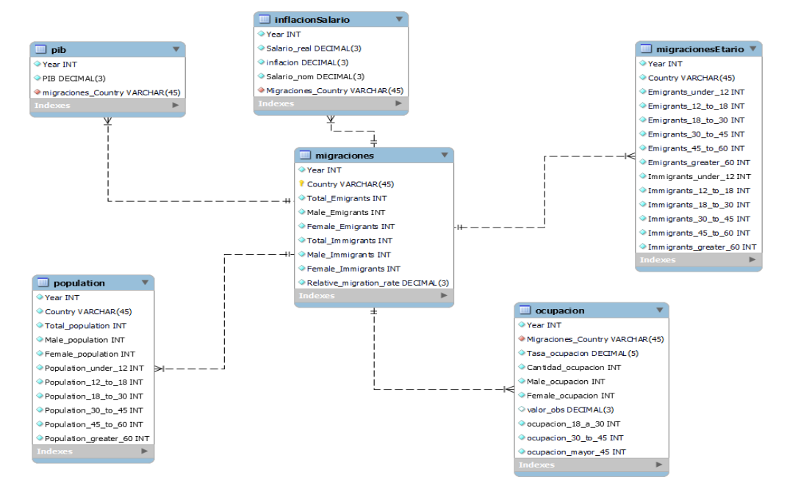

<h1 align="center"> Flujos Migratorios </h1>
<h3 align="center"> an approach to the well-being of the migrant </h3>

 **Content:**
 ---

- [Proyect ](#proyecto)
- [Team ](#equipo)
- [Respository](#repo)
- [Pipeline](#pipeline)

# Proyect 

In this repository is the development of a project whose objective is the creation of an interactive dashboard for access to information regarding migration from 22 different countries of the American continent. Migration is the displacement of a population that occurs from one place to another and entails a change of habitual residence in the case of people. For this reason, the prediction of these events and their effects in the different countries studied is of interest to society, especially to national non-governmental organizations.
Taking this into account, a project is proposed in which:

- Facilitate decision-making regarding the migratory flow for each of the countries within our reach.
- Delimit the necessary strategies for migration (emigrants and immigrants), classified according to the economic and social impact that it has.
   -Predict migratory flows for the coming years

This was achieved by:
- The extraction of data automatically through web scraping.
- The development of a learning model
- The implementation of a recommendation system based on the analysis of migrations, migrants, their characteristics and the factors in which they influence economically

# Team 
|Name         | Email                    | GitHub                                          |
|----------------|----------------------------|-------------------------------------------------|
|Alejandro Morales Garcia |alejandro.m.gci@gmail.com    |[ALEX-MGS](https://github.com/ALEX-MGS)    |
|Rolando Huahuala Cuyubamba |drgualas@gmail.com   |[elgualas](https://github.com/elgualas)            |
|Alejandro Flores Chávez |afloresch144@gmail.com|[molten1919](https://github.com/molten1919)|[
|Julián Eduardo Mena|julianmenachavez@gmail.com  |[JulinkG](https://github.com/JulinkG)            |
|Alexander Gutierrez Miranda |aljose30@gmail.com    |[Aljose30](https://github.com/Aljose30)        |

# Repository
The following files are in the repository:
- `desaparecidos`: data of the disappeared migrants in the regions of the continent of America
- `inflacion`: data of the inflation of all the countries of America
- `pib`: data of the gross domestic product of the countries.
- `rangos`: age range of the population divided by sex.
- `retornos`: data of the migrants who returned to their country
- `automatizacion`: notebook file where the entire web scraping and data cleaning process is executed.

# Branches 
  * `Machine_Learning_models`: In this branch you can find the machine learning models

# Pipeline
## Data extraction
With the selenium library we execute web scraping on the pages that contain data to download that works for us
## Data treatment
After the data extraction step, we will obtain raw data which we will have to clean to use in our machine learning models.
## Datawarehouse
This clean data is entered into our relational tables that are located in Amazon RDS and are connected via a python script with the credentials.
## Database schema
This star type schema contains the 'migrations' fact table, which is connected to tables that store data related to this phenomenon such as GDP, inflation and salary, also dividing them by age range and sex. Being as follows:

  

later this data is loaded to power bi for its due presentation in a dashboard.

A diagram of the pipeline is below:

  

